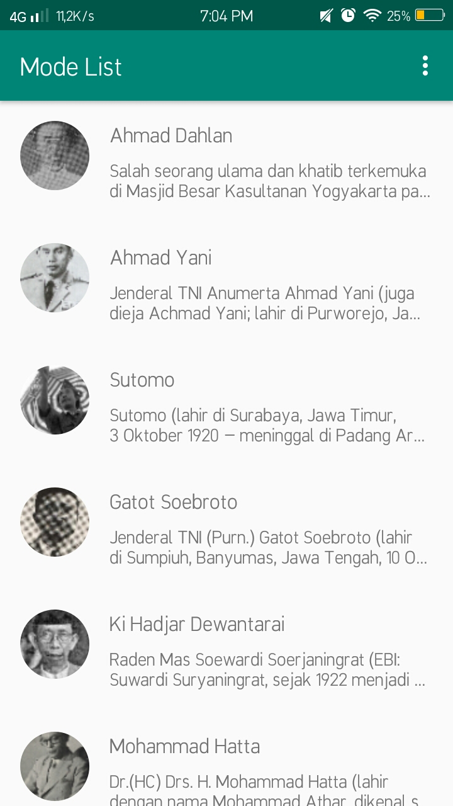

# RecyclerView
## Pengertian
> Widget RecyclerView adalah versi yang lebih canggih dan fleksibel dari ListView. RecyclerView adalah sebuah komponen tampilan (widget) yang lebih canggih ketimbang pendahulunya listview. Ia bersifat lebih fleksibel. RecyclerView memiliki kemampuan untuk menampilkan data secara efisien dalam jumlah yang besar. Terlebih jika memiliki koleksi data dengan elemen yang mampu berubah-ubah sewaktu dijalankan (runtime).
## Mengimplementasikan RecyclerView 
### Langkah-langkah mengimplementasikan recyclerview sebagai berikut :
> - [x] Tambahkan dependencies komponen recyclerview pada file build.gradle  level modul.
> - [x] Tambahkan obyek RecyclerView di berkas layout xml dari activity / fragment.
> - [x] Definisikan model kelas (POJO) yang akan digunakan sebagai data source.
> - [x] Buat berkas layout xml untuk baris item di RecyclerView.
> - [x] Buat sebuah kelas adapter yang inherit ke RecyclerView.Adapter dan ViewHolder untuk menampilkan tiap elemen data.
> - [x] Definisikan obyek RecyclerView berikut dengan bentuk yang diinginkan (bisa dalam bentuk list, grid, atau staggered) dan selanjutnya pasang obyek adapter (binding) agar bisa menampilkan koleksi data ke dalam RecyclerView.

> jika anda ingin membaca lebih lanjut tentang
> - List Card [klik disini](https://developer.android.com/guide/topics/ui/layout/recyclerview)
> - RecyclerView [klik disini](https://developer.android.com/reference/android/support/v7/widget/RecyclerView.html)

# Contoh penerapan Recyclerview

## Mode List
> Contoh dari RecyclerView yang akan kita buat dalam dalam bentuk list dengan bentuk kartu menggunakan cardview di mana semuanya berada dalam satu halaman saja. mode list ini berisi gambar yang menggunakan circle image view dengan menggunakan implementasi (implementation 'de.hdodenhof:circleimageview:3.0.0') pada dependecies di build.grade(Module:app) dan text.

## Fasilitas Menu
> Fitur ini digunakan untuk beralih mode, mode list, mode grid dan mode card view.

## Mode Grid 
> Pada mode grid ini berisi foto foto pahlawan yang ditampilkan dalam mode grid dengan menggunakan linear layout

# Arigatōgozaimashita, Gamsahabnida,Thank you,Maturnuwun, Terimakasih🤗
